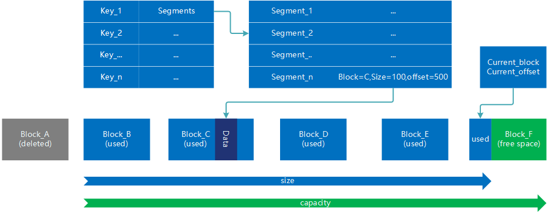

`level cache`是一个golang编写支持分片存储的多级的缓存库。整体设计上在保障性能够用的前提下尽可能的通过设计方案简化代码实现，便于维护和二次开发。该库能够管理多种速度价格不同的设备进行对象分片的功能，实现性能和价格的平衡。`level cache`以分片为粒度进行数据的存储和热点管理，方便类似视频的数据进行分段缓存。

项目地址:https://github.com/GhostZCH/levelcache

## 特色功能

+ 支持多级缓存，自动将热点分片移动到高级别的设备中，并优先读取
+ 任何可以挂载为linux目录的设备都可以被使用，例如内存可以使用`/dev/shm/`作为缓存路径
+ 以分片为粒度存储，方便只缓存部分数据后将对象的一部分放到更高级别的设备中
+ 调用者可以实现Auxiliary接口来存储附加对象信息，这些信息能够方便调用者进行更多的判断和统计，同时通过Auxiliary可以实现自定义批量删除，诸如按照类型，正则表达式，分组，前后缀的删除都是可以实现的
+ 块文件在初始化时通过mmap加载，合理使用可减少内存拷贝

## 接口

### Cache操作

#### NewCache 初始化一个新的缓存对象

    // devices: 设备配置，级别依次升高，基本越高的设备速度应该越快
    func NewCache(conf Config, devices []DevConf) *Cache

#### Close() 关闭，保存文件，关闭句柄

#### Dump() 保存元数据，建议周期性的调用，防止程序意外退出造成较大损失

#### 示例：

    conf := cache.Config{
        MetaDir:        "/tmp/cache/meta/",
        ActionParallel: 4,
        AuxFactory:     NewHttpAux}

    devices := [3]cache.DevConf{
        cache.DevConf{
            Name:     "hdd",
            Dir:      "/tmp/cache/hdd/",
            Capacity: 1000 * 1024 * 1024},
        cache.DevConf{
            Name:     "ssd",
            Dir:      "/tmp/cache/ssd/",
            Capacity: 100 * 1024 * 1024},
        cache.DevConf{
            Name:     "mem",
            Dir:      "/tmp/cache/mem/",　//实际可以使用而 /dev/shm/xxxx/
            Capacity: 10 * 1024 * 1024},
    }

    c := cache.NewCache(conf, devices[:])
    defer c.Close()

    go func() {
        time.Sleep(time.Minute)
        c.Dump()
    }()

### 对象操作

#### Get

    // 获得缓存对象某一部分的数据，end = -1 时表示获取到数据文件末尾,每次get后相应的数据分片可能会被调整到速度更快的缓存设备中
    // dataList: 数据分片的列表
    // hitDevs: 命中的
    // missSegments: 示缺失的数据分片，每个元素[2]int的内容是对应分片的start与end
    func (c *Cache) Get(key Hash, start int, end int) (dataList [][]byte, hitDevs []string, missSegments [][2]int) {

#### AddItem

    // 增加一个缓存对象，只包含基础信息，不包含缓存数据和分片

    func (c *Cache) AddItem(key Hash, expire, size int64, auxData interface{})

#### AddSegment

    // 添加一个分片
    func (c *Cache) AddSegment(key Hash, start int, data []byte)

#### Del

    // 删除一个对象，包含所属的分片
    func (c *Cache) Del(k Hash)

#### DelBatch

    // 批量删除，根据设置的并行数n, 每次读锁定n个桶进行匹配返回key，之后加写锁对这些key进行单个删除
    func (c *Cache) DelBatch(m Matcher)

#### 示例

    pngkey := md5.Sum([]byte("http://www.test.com/123/456/1.png"))

    png := []byte("this is 1.png")

    c.AddItem(pngkey, time.Now().Unix()+3600, int64(len(jpg)), httpAuxData{
        fileType: crc32.ChecksumIEEE([]byte("png")),
        rawKey:   []byte("http://www.test.com/123/456/1.png")})

    c.AddSegment(pngkey, 0, png)

    c.Del(pngkey)

    c.DelBatch(func(aux cache.Auxiliary) []cache.Hash {
        keys := make([]cache.Hash, 0)
        for k, v := range aux.(*httpAux).datas {
            if v.fileType == crc32.ChecksumIEEE([]byte("jpg")) {
                keys = append(keys, k)
            }
        }
        return keys
    })

### 类型定义

    // 存储key
    type Hash [md5.Size]byte

    // 批量删除的回调函数，用于批量删除时在用户自定义数据中查找需要删除的数据，每个桶执行一次，不需要调用者加锁
    type Matcher func(aux Auxiliary) []Hash

    // 设备初始化配置
    type DevConf struct {
        Name     string
        Dir      string
        Capacity int
    }

    // 缓存库公共配置
    type Config struct {
        MetaDir        string       // 元数据文件存放的目录建议放在非易失存储上
        ActionParallel int　　　　　　// 批量删除和备份元数据等批量耗时操作的并发数，建议设置为cpu数的一半
        AuxFactory     AuxFactory　　// 产生附加数据的工厂函数,meta中的每个桶会包含一个自定义附加数据，用于方便删除
    }

    // 产生附加数据的工厂函数，用作新建缓存的参数
    type AuxFactory func(idx int) Auxiliary

    // 调用者附加数据接口，由调用者根据业务情况设计数据结构实现相关的方法，不需要调用者加锁
    type Auxiliary interface {
        Add(key Hash, auxItem interface{})
        Get(key Hash) interface{}
        Del(key Hash)
        Load(path string)　// 从指定文件加载内容，NewCache时触发，每个桶触发一次，path不同
        Dump(path string)  // 向指定文件持久化数据，
    }

## 示例

详见`example/main.go`

    type httpAuxData struct {
        fileType  uint32
        etagCRC   uint32
        rawKey    []byte
    }

    type httpAux struct {
        datas map[cache.Hash]httpAuxData
    }

    func (aux *httpAux) Add(key cache.Hash, auxItem interface{}) {
        aux.datas[key] = auxItem.(httpAuxData)
    }

    func (aux *httpAux) Get(key cache.Hash) interface{} {
        data, _ := aux.datas[key]
        return data
    }

    func (aux *httpAux) Del(key cache.Hash) {
        delete(aux.datas, key)
    }

    func (aux *httpAux) Load(path string) {
        return
    }

    func (aux *httpAux) Dump(path string) {
        return
    }

    func NewHttpAux(idx int) cache.Auxiliary {
        return &httpAux{datas: make(map[cache.Hash]httpAuxData)}
    }

    func main() {
        // 初始化存储
        conf := cache.Config{
            MetaDir:        "/tmp/cache/meta/",
            ActionParallel: 4,
            AuxFactory:     NewHttpAux}

        //　大容量存储在前，快速存储在后,最低级存储建议用非易失存储
        devices := [3]cache.DevConf{
            cache.DevConf{
                Name:     "hdd",
                Dir:      "/tmp/cache/hdd/",
                Capacity: 1000 * 1024 * 1024},
            cache.DevConf{
                Name:     "ssd",
                Dir:      "/tmp/cache/ssd/",
                Capacity: 100 * 1024 * 1024},
            cache.DevConf{
                Name:     "mem",
                Dir:      "/tmp/cache/mem/",　//实际可以使用而 /dev/shm/xxxx/
                Capacity: 10 * 1024 * 1024},
        }

        c := cache.NewCache(conf, devices[:])
        defer c.Close()

        go func() {
            time.Sleep(time.Minute)
            c.Dump()
        }()

        // 添加一个对象
        fmt.Println("add jpg")

        jpgkey := md5.Sum([]byte("http://www.test.com/123/456/1.jpg"))
        jpg := []byte("this is 1.jpg")

        c.AddItem(jpgkey, time.Now().Unix()+3600, int64(len(jpg)), httpAuxData{
            fileType: crc32.ChecksumIEEE([]byte("jpg")),
            rawKey:   []byte("http://www.test.com/123/456/1.jpg")})

        c.AddSegment(jpgkey, 0, jpg)

        // 热点数据升级到更快的存储中
        fmt.Println(c.Get(jpgkey, 0, -1)) // hdd
        fmt.Println(c.Get(jpgkey, 0, -1)) // ssd
        fmt.Println(c.Get(jpgkey, 0, -1)) // mem

        // 添加另一个对象
        fmt.Println("add png")

        pngkey := md5.Sum([]byte("http://www.test.com/123/456/1.png"))
        png := []byte("this is 1.png")

        c.AddItem(pngkey, time.Now().Unix()+3600, int64(len(jpg)), httpAuxData{
            fileType: crc32.ChecksumIEEE([]byte("png")),
            rawKey:   []byte("http://www.test.com/123/456/1.png")})

        c.AddSegment(pngkey, 0, png)

        fmt.Println(c.Get(jpgkey, 0, -1))

        //　删除类型为jpg的文件
        fmt.Println("Del jpg")

        c.DelBatch(func(aux cache.Auxiliary) []cache.Hash {
            keys := make([]cache.Hash, 0)
            for k, v := range aux.(*httpAux).datas {
                if v.fileType == crc32.ChecksumIEEE([]byte("jpg")) {
                    keys = append(keys, k)
                }
            }
            return keys
        })

        // 按照正则删除文件
        fmt.Println("Del regex")

        r := regexp.MustCompile(`http://www.test.com/123/.*png`)

        c.DelBatch(func(aux cache.Auxiliary) []cache.Hash {
            keys := make([]cache.Hash, 0)
            for k, v := range aux.(*httpAux).datas {
                if r.Match(v.rawKey) {
                    fmt.Println("match", string(v.rawKey))
                    keys = append(keys, k)
                }
            }
            return keys
        })
    }

## 设计

主要对象的结构如下

+ Cache包含Meta和一个Device组成的数组
+ Meta用于存储item的基础信息和Aux信息，Meta被分成256个桶，对象按照key的第一个byte判断在哪个桶中。每个桶各自独立，有独立的锁，每次只锁定1/256的数据，减少批量删除和持久化操作对整个系统的影响
+ Device数组按照存储级别由低到高设置，高级别时更快的设备。每个设备主要包含两部分内容，store用于管理存储空间分配和回收。buckets用于管理segment的元数据信息，也采用了和Meta类似的分桶逻辑减少锁对系统平稳的影响。为了减少代码量，所有的Device配置都使用linux目录方式，也就是不论内存、ssd、hdd或者是nfs，都可以复用同一套管理代码，只要可以被挂载为linux目录即可

+ Auxiliary是一个由使用者实现的借口，方便调用者按照自身的业务逻辑进行批量删除等操作，每MetaBucket会实例化一个，由库保证线程安全

device的内部结构如上图，只以ＨDD为例画出一个，所有device具有相同的管理逻辑
+ device内主要由segments（处于buckets内）和store组成，
+ Store采用FIFO大文件块队列的方式进行内容存储，每个块存储若干文件，当空间不够时，会新增一个文件块并删除一个旧块，新增加的存储位于文件块的末尾

## TODO

+ 增加测试并修复bug
+ 改进热点对象加入高级别缓存逻辑
+ 性能优化减少不必要的对象申请
+ 数据统计
+ 增量备份
